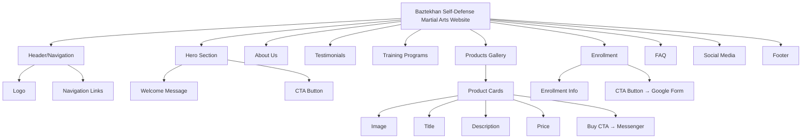

# Baztekhan Self-Defense Martial Arts - Website Documentation

## Table of Contents
1. [Project Overview](#project-overview)
2. [Technical Specifications](#technical-specifications)
3. [Design System](#design-system)
4. [Website Architecture](#website-architecture)
5. [Component Library](#component-library)
6. [Data Structures](#data-structures)
7. [Implementation Guide](#implementation-guide)
8. [Testing & Deployment](#testing--deployment)
9. [Maintenance & Updates](#maintenance--updates)

---

## Project Overview

### Business Information
- **Business Name:** Baztekhan Self-Defense Martial Arts
- **Website Type:** Mixed Martial Arts (MMA) themed website
- **Primary Purpose:** Showcase martial arts accessories, training programs, and testimonials
- **Contact Method:** Facebook Messenger (no payment gateway)

### Key Features
- Mobile-first responsive design
- Product gallery with Facebook Messenger integration for purchases
- Training programs showcase
- Testimonials section
- Enrollment via Google Form
- FAQ section
- Social media integration

### External Links
| Service | URL |
|---------|-----|
| Facebook Page | `https://www.facebook.com/baztekhanselfdefense` |
| Facebook Messenger | `m.me/793745347671698` |
| Google Form (Enrollment) | `https://forms.gle/MKrBq4m5kRkSHGwdA` |

---

## Technical Specifications

### Tech Stack
| Technology | Purpose | Version |
|------------|---------|---------|
| React | Frontend Framework | 18.x |
| Tailwind CSS | Styling Framework | 3.x |
| JavaScript | Programming Language | ES6+ |
| Vite | Build Tool | 5.x |

### Project Structure
```
baztekhan-self-defense-website/
├── public/
│   ├── img/
│   │   └── Baztekhan Arts logo.png
│   └── index.html
├── src/
│   ├── components/
│   │   ├── Button.jsx
│   │   ├── Card.jsx
│   │   ├── Section.jsx
│   │   ├── Header.jsx
│   │   ├── Footer.jsx
│   │   ├── Hero.jsx
│   │   ├── About.jsx
│   │   ├── Testimonials.jsx
│   │   ├── Programs.jsx
│   │   ├── Products.jsx
│   │   ├── Enrollment.jsx
│   │   ├── FAQ.jsx
│   │   └── SocialMedia.jsx
│   ├── data/
│   │   ├── products.js
│   │   ├── testimonials.js
│   │   ├── programs.js
│   │   └── faqs.js
│   ├── App.jsx
│   ├── main.jsx
│   └── index.css
├── tailwind.config.js
├── vite.config.js
└── package.json
```

### Dependencies
```json
{
  "dependencies": {
    "react": "^18.2.0",
    "react-dom": "^18.2.0"
  },
  "devDependencies": {
    "@vitejs/plugin-react": "^4.2.0",
    "autoprefixer": "^10.4.16",
    "postcss": "^8.4.31",
    "tailwindcss": "^3.3.5",
    "vite": "^5.0.0"
  }
}
```

---

## Design System

### Brand Colors
| Color Name | Hex Code | Tailwind Class | Usage |
|------------|----------|----------------|-------|
| Black | `#000000` | `bg-brand-black` | Primary background, text |
| Red | `#DC2626` | `bg-brand-red` | Primary buttons, accents |
| Gold | `#F59E0B` | `bg-brand-gold` | Secondary buttons, highlights |
| White | `#FFFFFF` | `bg-brand-white` | Backgrounds, text |

### Tailwind Configuration
```javascript
// tailwind.config.js
module.exports = {
  theme: {
    extend: {
      colors: {
        brand: {
          black: '#000000',
          red: '#DC2626',
          gold: '#F59E0B',
          white: '#FFFFFF',
        }
      }
    }
  }
}
```

### Typography
- **Font Family:** System fonts (San Francisco, Segoe UI, Roboto)
- **Headings:** Bold, uppercase for main headings
- **Body Text:** Regular weight, readable on mobile
- **Button Text:** Bold, uppercase

### Spacing Scale
- Mobile: 4px base unit
- Tablet: 8px base unit
- Desktop: 16px base unit

### Breakpoints
| Breakpoint | Screen Width | Usage |
|------------|---------------|-------|
| `sm` | 640px | Small tablets |
| `md` | 768px | Tablets |
| `lg` | 1024px | Small desktops |
| `xl` | 1280px | Desktops |
| `2xl` | 1536px | Large desktops |

---

## Website Architecture

### Page Sections



### Section Details

#### 1. Header/Navigation
- **Component:** `Header.jsx`
- **Features:**
  - Sticky header for easy navigation
  - Logo: `img/Baztekhan Arts logo.png`
  - Navigation links: Home, About, Programs, Products, Enrollment, FAQ
  - Mobile-responsive hamburger menu
- **CTA Actions:** None (navigation only)

#### 2. Hero Section
- **Component:** `Hero.jsx`
- **Purpose:** Welcoming page for martial arts enthusiasts
- **Content:**
  - Compelling headline
  - Subheadline about martial arts training
  - Hero image or background
  - CTA button: "Start Your Journey" → Scrolls to Enrollment section
- **Design:** Bold, energetic, using brand colors

#### 3. About Us Section
- **Component:** `About.jsx`
- **Purpose:** Company story and mission
- **Content:**
  - Brief history of Baztekhan Self-Defense Martial Arts
  - Mission statement
  - Values and philosophy
  - What makes the academy unique
- **Design:** Clean, professional layout

#### 4. Testimonials Section
- **Component:** `Testimonials.jsx`
- **Purpose:** Social proof from satisfied customers
- **Content:** 3-5 placeholder testimonials
  - Customer name
  - Quote/testimonial text
  - Star rating
  - Optional: Profile photo placeholder
- **Design:** Card-based layout, carousel or grid

#### 5. Training Programs Section
- **Component:** `Programs.jsx`
- **Purpose:** Showcase available martial arts programs
- **Content:**
  - Program cards with:
    - Program name (Karate, Kick-Boxing, Combat Aikido, Arnis De Mano, MMA)
    - Brief description
    - MMA program includes image: `img/Capture1.PNG`
    - Duration/Frequency
    - Skill level (Beginner, Intermediate, Advanced)
    - CTA button: "Learn More" → Scrolls to Enrollment
- **Design:** 5-column grid layout (responsive: 1 column mobile, 2 columns tablet, 5 columns desktop) with program cards

#### 6. Products Gallery Section
- **Component:** `Products.jsx`
- **Purpose:** Display martial arts accessories for sale
- **Content:** 5-10 placeholder products
  - Product image (placeholder)
  - Product name
  - Description
  - Price
  - CTA button: "Buy Now" → Opens Facebook Messenger with pre-filled message
- **Design:** Grid layout with product cards
- **Note:** No payment gateway - all purchases via Facebook chat

#### 7. Enrollment Section
- **Component:** `Enrollment.jsx`
- **Purpose:** Encourage sign-ups for training programs
- **Content:**
  - Enrollment benefits
  - Steps to enroll
  - CTA button: "Enroll Now" → Opens Google Form
- **Design:** Prominent, attention-grabbing section

#### 8. FAQ Section
- **Component:** `FAQ.jsx`
- **Purpose:** Answer common questions
- **Content:** Accordion-style FAQ with questions like:
  - What martial arts styles do you teach?
  - Do I need prior experience?
  - What should I wear to class?
  - How much are the training fees?
  - Can I try a class before committing?
- **Design:** Expandable/collapsible accordion

#### 9. Social Media Section
- **Component:** `SocialMedia.jsx`
- **Purpose:** Connect with audience on social platforms
- **Content:**
  - Facebook Page: `https://www.facebook.com/baztekhanselfdefense`
  - Instagram link (if available)
  - YouTube link (if available)
  - Social media icons with hover effects
- **Design:** Clean, centered layout

#### 10. Footer
- **Component:** `Footer.jsx`
- **Purpose:** Quick links and additional information
- **Content:**
  - Quick links: Home, About, Programs, Products, Enrollment, FAQ
  - Copyright notice
  - Social media icons
- **Design:** Dark background (black) with gold accents

---

## Component Library

### Button Component
**File:** `src/components/Button.jsx`

**Props:**
| Prop | Type | Default | Description |
|------|------|---------|-------------|
| `variant` | `'primary' \| 'secondary' \| 'outline'` | `'primary'` | Button style variant |
| `size` | `'sm' \| 'md' \| 'lg'` | `'md'` | Button size |
| `href` | `string` | `undefined` | Link URL (if provided, renders as `<a>`) |
| `children` | `ReactNode` | - | Button content |
| `onClick` | `function` | - | Click handler |

**Variants:**
- **Primary:** Red background, white text
- **Secondary:** Gold background, black text
- **Outline:** Black border, black text

**Example Usage:**
```jsx
<Button variant="primary" href="https://m.me/793745347671698">
  Buy Now
</Button>
```

### Card Component
**File:** `src/components/Card.jsx`

**Props:**
| Prop | Type | Default | Description |
|------|------|---------|-------------|
| `title` | `string` | - | Card title |
| `description` | `string` | - | Card description |
| `image` | `string` | - | Image URL |
| `price` | `string` | - | Price (optional) |
| `cta` | `object` | - | CTA button props |
| `children` | `ReactNode` | - | Additional content |

**Example Usage:**
```jsx
<Card
  title="MMA Gloves"
  description="Professional-grade MMA gloves"
  price="₱1,500"
  image="/placeholder-product-1.jpg"
  cta={{ text: "Buy Now", href: "https://m.me/793745347671698" }}
/>
```

### Section Component
**File:** `src/components/Section.jsx`

**Props:**
| Prop | Type | Default | Description |
|------|------|---------|-------------|
| `id` | `string` | - | Section ID for navigation |
| `title` | `string` | - | Section title |
| `subtitle` | `string` | - | Section subtitle |
| `children` | `ReactNode` | - | Section content |

**Example Usage:**
```jsx
<Section id="about" title="About Us" subtitle="Our Story">
  <p>Baztekhan Self-Defense Martial Arts...</p>
</Section>
```

### FAQ Item Component
**File:** `src/components/FAQItem.jsx`

**Props:**
| Prop | Type | Default | Description |
|------|------|---------|-------------|
| `question` | `string` | - | FAQ question |
| `answer` | `string` | - | FAQ answer |

**Example Usage:**
```jsx
<FAQItem
  question="What martial arts styles do you teach?"
  answer="We offer training in MMA, Brazilian Jiu-Jitsu, Muay Thai, and Boxing."
/>
```

---

## Data Structures

### Products Data
**File:** `src/data/products.js`

```javascript
export const products = [
  {
    id: 1,
    name: "MMA Gloves",
    description: "Professional-grade MMA gloves for training and competition",
    price: "₱1,500",
    image: "/placeholder-product-1.jpg"
  },
  {
    id: 2,
    name: "Boxing Gloves",
    description: "High-quality boxing gloves for sparring and bag work",
    price: "₱1,200",
    image: "/placeholder-product-2.jpg"
  },
  {
    id: 3,
    name: "MMA Shorts",
    description: "Comfortable and durable MMA shorts for training",
    price: "₱800",
    image: "/placeholder-product-3.jpg"
  },
  {
    id: 4,
    name: "Hand Wraps",
    description: "Protective hand wraps for wrist and knuckle support",
    price: "₱300",
    image: "/placeholder-product-4.jpg"
  },
  {
    id: 5,
    name: "Mouthguard",
    description: "Custom-fit mouthguard for dental protection",
    price: "₱500",
    image: "/placeholder-product-5.jpg"
  },
  {
    id: 6,
    name: "Shin Guards",
    description: "Protective shin guards for kickboxing and Muay Thai",
    price: "₱1,000",
    image: "/placeholder-product-6.jpg"
  },
  {
    id: 7,
    name: "Headgear",
    description: "Protective headgear for sparring sessions",
    price: "₱1,800",
    image: "/placeholder-product-7.jpg"
  },
  {
    id: 8,
    name: "Rash Guard",
    description: "Compression rash guard for grappling and training",
    price: "₱700",
    image: "/placeholder-product-8.jpg"
  }
];
```

### Testimonials Data
**File:** `src/data/testimonials.js`

```javascript
export const testimonials = [
  {
    id: 1,
    name: "John Doe",
    quote: "Best martial arts training I've ever experienced! The instructors are knowledgeable and supportive.",
    rating: 5,
    image: "/placeholder-avatar-1.jpg"
  },
  {
    id: 2,
    name: "Jane Smith",
    quote: "I've learned so much in just a few months. The community here is amazing!",
    rating: 5,
    image: "/placeholder-avatar-2.jpg"
  },
  {
    id: 3,
    name: "Mike Johnson",
    quote: "Great facility and excellent coaching. Highly recommend for anyone interested in MMA.",
    rating: 5,
    image: "/placeholder-avatar-3.jpg"
  },
  {
    id: 4,
    name: "Sarah Williams",
    quote: "The self-defense classes have given me so much confidence. Thank you Baztekhan!",
    rating: 5,
    image: "/placeholder-avatar-4.jpg"
  },
  {
    id: 5,
    name: "David Chen",
    quote: "Professional training with a personal touch. Best decision I ever made was joining.",
    rating: 5,
    image: "/placeholder-avatar-5.jpg"
  }
];
```

### Programs Data
**File:** `src/data/programs.js`

```javascript
export const programs = [
  {
    id: 1,
    name: "Karate",
    description: "A traditional martial art emphasizing strikes, kicks, and blocks for self-defense and discipline",
    level: "All Levels",
    duration: "1 hour sessions",
    image: "/placeholder-program-1.jpg"
  },
  {
    id: 2,
    name: "Kick-Boxing",
    description: "High-energy combat sport combining boxing punches with martial arts kicks for striking excellence",
    level: "All Levels",
    duration: "1 hour sessions",
    image: "/placeholder-program-2.jpg"
  },
  {
    id: 3,
    name: "Combat Aikido",
    description: "Practical self-defense system using joint locks, throws, and redirection of an opponent's energy",
    level: "All Levels",
    duration: "1 hour sessions",
    image: "/placeholder-program-3.jpg"
  },
  {
    id: 4,
    name: "Arnis De Mano",
    description: "Filipino martial art specializing in stick fighting, knife techniques, and empty-hand combat",
    level: "All Levels",
    duration: "1 hour sessions",
    image: "/placeholder-program-4.jpg"
  },
  {
    id: 5,
    name: "MMA",
    description: "Comprehensive mixed martial arts training integrating striking, grappling, and ground fighting",
    level: "All Levels",
    duration: "1 hour sessions",
    image: "img/Capture1.PNG"
  }
];
```

### FAQ Data
**File:** `src/data/faqs.js`

```javascript
export const faqs = [
  {
    id: 1,
    question: "What martial arts styles do you teach?",
    answer: "We offer training in Karate, Kick-Boxing, Combat Aikido, Arnis De Mano, and Mixed Martial Arts (MMA)."
  },
  {
    id: 2,
    question: "Do I need prior experience to join?",
    answer: "No prior experience is required! We welcome beginners and offer classes for all skill levels from beginner to advanced."
  },
  {
    id: 3,
    question: "What should I wear to class?",
    answer: "For your first class, wear comfortable athletic clothing like shorts and a t-shirt. We recommend bringing a water bottle and towel."
  },
  {
    id: 4,
    question: "How much are the training fees?",
    answer: "Please contact us through our Facebook page or fill out the enrollment form to get information about our current pricing and membership options."
  },
  {
    id: 5,
    question: "Can I try a class before committing?",
    answer: "Yes! We offer trial classes for new students. Contact us to schedule your first session."
  },
  {
    id: 6,
    question: "Do you sell martial arts equipment?",
    answer: "Yes! We have a range of martial arts accessories available for purchase. Check out our Products section or message us on Facebook for more details."
  },
  {
    id: 7,
    question: "How do I enroll?",
    answer: "Simply click the 'Enroll Now' button in the Enrollment section to fill out our Google Form, or message us directly on Facebook."
  }
];
```

---

## Implementation Guide

### Setup Instructions

#### 1. Initialize Project
```bash
npm create vite@latest baztekhan-self-defense-website -- --template react
cd baztekhan-self-defense-website
npm install
```

#### 2. Install Tailwind CSS
```bash
npm install -D tailwindcss postcss autoprefixer
npx tailwindcss init -p
```

#### 3. Configure Tailwind
Update `tailwind.config.js`:
```javascript
module.exports = {
  content: [
    "./index.html",
    "./src/**/*.{js,ts,jsx,tsx}",
  ],
  theme: {
    extend: {
      colors: {
        brand: {
          black: '#000000',
          red: '#DC2626',
          gold: '#F59E0B',
          white: '#FFFFFF',
        }
      }
    },
  },
  plugins: [],
}
```

#### 4. Add Tailwind Directives
Update `src/index.css`:
```css
@tailwind base;
@tailwind components;
@tailwind utilities;

body {
  @apply bg-brand-white text-brand-black;
}
```

#### 5. Copy Logo
Copy `img/Baztekhan Arts logo.png` to `public/img/` directory.

### Component Implementation Order

1. **Base Components** (No dependencies)
   - Button
   - Card
   - Section
   - FAQItem

2. **Layout Components** (Depend on base components)
   - Header
   - Footer

3. **Section Components** (Depend on base and layout components)
   - Hero
   - About
   - Testimonials
   - Programs
   - Products
   - Enrollment
   - FAQ
   - SocialMedia

4. **Main App** (Assembles all sections)
   - App.jsx

### Mobile-First Design Principles

1. **Start with Mobile Styles**
   - Write base styles for mobile (default)
   - Use `md:`, `lg:`, `xl:` prefixes for larger screens

2. **Touch-Friendly Interactions**
   - Minimum button size: 44x44px
   - Adequate spacing between clickable elements
   - Large tap targets for navigation

3. **Performance Optimization**
   - Lazy load images
   - Optimize image sizes for mobile
   - Minimize JavaScript bundle size

4. **Responsive Typography**
   - Use relative units (rem, em)
   - Scale font sizes with breakpoints
   - Ensure readability on small screens

### CTA Button Implementation

#### Product Buy Button
```jsx
<Button
  variant="primary"
  href={`https://m.me/793745347671698?text=I'm interested in buying ${productName}`}
>
  Buy Now
</Button>
```

#### Enrollment CTA Button
```jsx
<Button
  variant="primary"
  href="https://forms.gle/MKrBq4m5kRkSHGwdA"
  target="_blank"
  rel="noopener noreferrer"
>
  Enroll Now
</Button>
```

#### Program CTA Button
```jsx
<Button
  variant="secondary"
  onClick={() => document.getElementById('enrollment').scrollIntoView({ behavior: 'smooth' })}
>
  Learn More
</Button>
```

---

## Testing & Deployment

### Testing Checklist

#### Functionality Testing
- [ ] All navigation links work correctly
- [ ] All CTA buttons redirect to correct URLs
- [ ] Facebook Messenger opens with pre-filled message
- [ ] Google Form opens in new tab
- [ ] Smooth scrolling works between sections
- [ ] Mobile menu toggles correctly
- [ ] FAQ accordion expands/collapses

#### Responsive Testing
- [ ] Mobile (< 640px) layout displays correctly
- [ ] Tablet (640px - 1024px) layout displays correctly
- [ ] Desktop (> 1024px) layout displays correctly
- [ ] Images scale properly across devices
- [ ] Text remains readable on all screen sizes

#### Cross-Browser Testing
- [ ] Chrome
- [ ] Firefox
- [ ] Safari
- [ ] Edge
- [ ] Mobile Safari (iOS)
- [ ] Chrome Mobile (Android)

#### Performance Testing
- [ ] Page load time < 3 seconds on 4G
- [ ] Lighthouse score > 90
- [ ] Images optimized and compressed
- [ ] JavaScript bundle size minimized

### Deployment Instructions

#### Build for Production
```bash
npm run build
```

#### Deploy to Vercel (Recommended)
```bash
npm install -g vercel
vercel
```

#### Deploy to Netlify
```bash
npm install -g netlify-cli
netlify deploy --prod
```

#### Deploy to GitHub Pages
```bash
npm run build
# Push dist folder to gh-pages branch
```

---

## Maintenance & Updates

### Content Updates

#### Update Products
Edit `src/data/products.js`:
```javascript
export const products = [
  {
    id: 1,
    name: "New Product Name",
    description: "Updated description",
    price: "₱2,000",
    image: "/new-product-image.jpg"
  },
  // ... other products
];
```

#### Update Testimonials
Edit `src/data/testimonials.js`:
```javascript
export const testimonials = [
  {
    id: 1,
    name: "New Customer Name",
    quote: "New testimonial text",
    rating: 5,
    image: "/new-avatar.jpg"
  },
  // ... other testimonials
];
```

#### Update Programs
Edit `src/data/programs.js`:
```javascript
export const programs = [
  {
    id: 1,
    name: "New Program Name",
    description: "Updated program description",
    level: "All Levels",
    duration: "1 hour sessions",
    image: "/new-program-image.jpg"
  },
  // ... other programs
];
```

#### Update FAQ
Edit `src/data/faqs.js`:
```javascript
export const faqs = [
  {
    id: 1,
    question: "New question?",
    answer: "New answer."
  },
  // ... other FAQs
];
```

### Image Updates

1. Replace placeholder images in `public/img/` directory
2. Update image paths in data files
3. Ensure images are optimized (WebP format recommended)
4. Use responsive images with `srcset` for better performance

### External Link Updates

#### Update Facebook Page Link
Search and replace `https://www.facebook.com/baztekhanselfdefense` throughout the codebase.

#### Update Facebook Messenger Link
Search and replace `m.me/793745347671698` throughout the codebase.

#### Update Google Form Link
Search and replace `https://forms.gle/MKrBq4m5kRkSHGwdA` throughout the codebase.

### Color Scheme Updates

To update brand colors, modify `tailwind.config.js`:
```javascript
colors: {
  brand: {
    black: '#NEW_HEX',
    red: '#NEW_HEX',
    gold: '#NEW_HEX',
    white: '#NEW_HEX',
  }
}
```

---

## Success Criteria

The website will be considered successful when:

- ✅ Website loads quickly and is fully responsive (mobile-first approach)
- ✅ All CTA buttons correctly redirect to Facebook Messenger or Google Form
- ✅ Design matches brand colors (Black, Red, Gold, White)
- ✅ All sections are accessible and easy to navigate
- ✅ Placeholder content is easy to replace with real content
- ✅ No payment gateway required (all via Facebook chat)
- ✅ Facebook Page link properly integrated: `https://www.facebook.com/baztekhanselfdefense`
- ✅ Cross-browser compatibility achieved
- ✅ Performance benchmarks met (Lighthouse score > 90)
- ✅ Mobile menu functions correctly on all devices

---

## Future Enhancements

### Potential Features to Add Later
- WhatsApp integration as alternative contact method
- Blog/News section for martial arts articles
- Video gallery of training sessions
- Online booking system for classes
- Member portal for enrolled students
- E-commerce integration with payment gateway
- Multi-language support
- Dark mode toggle
- Advanced search functionality
- Product filtering and sorting

### Technical Improvements
- Implement server-side rendering (Next.js)
- Add progressive web app (PWA) capabilities
- Integrate analytics (Google Analytics)
- Add SEO optimization tools
- Implement content management system (CMS)
- Add automated testing (Jest, Cypress)
- Set up CI/CD pipeline

---

## Contact & Support

For questions or issues related to this project:
- **Facebook Page:** https://www.facebook.com/baztekhanselfdefense
- **Facebook Messenger:** m.me/793745347671698

---

*Document Version: 1.0*
*Last Updated: 2026-02-09*
